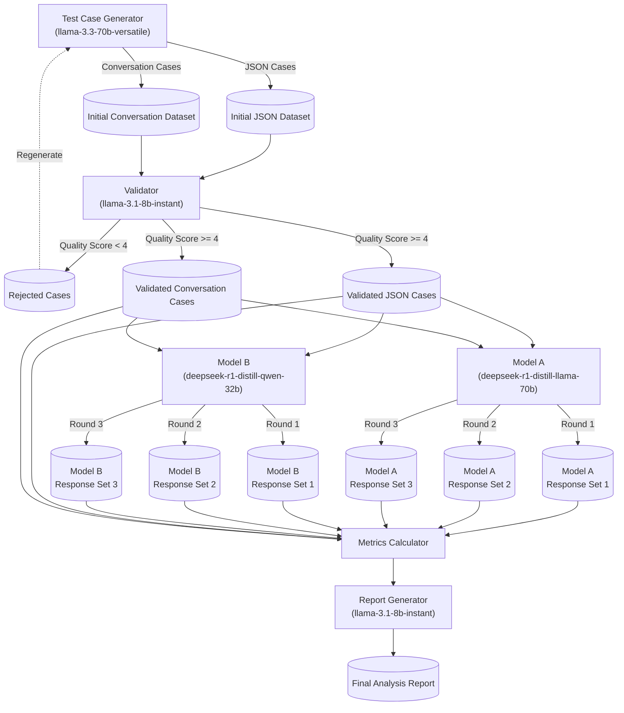

# AI Model Benchmarking Pipeline

A comprehensive pipeline for benchmarking LLM performance using Groq's API. This framework specializes in evaluating model performance in customer service scenarios through automatic test generation, validation, and metrics analysis.

## 🚀 Key Features

- Tool-based test case generation using LLMs
- Multi-stage validation with quality scoring
- A/B testing framework for model comparison
- Comprehensive metrics calculation
  - Conversation metrics: BLEU, WER, response relevance, clarity, task completion
  - JSON metrics: schema compliance, field accuracy, structural consistency
- Asynchronous execution with robust error handling
- Configurable feature flags for different test types
- Automated analysis report generation

## 📋 Prerequisites

```bash
# Python packages
langchain>=0.1.0
langchain-groq>=0.1.0
langchain-community>=0.1.0
nltk>=3.8.1
jiwer>=3.0.1
pandas>=2.0.0
numpy>=1.24.0
tqdm>=4.66.0
rich>=13.7.0
jsonschema>=4.21.1
json-schema-validator>=0.2.0
matplotlib>=3.8.0
seaborn>=0.13.0
asyncio>=3.4.3
python-dotenv>=1.0.0
jupyter>=1.0.0
ipykernel>=6.0.0
nest-asyncio>=1.5.8

# Environment Setup
export GROQ_API_KEY="your_api_key_here"
```

## 🏗️ Architecture



The pipeline consists of four main phases, each utilizing specialized LLM agents with tool capabilities:

### 1. Generation Phase
- **Agent**: Test Case Generator (llama-3.3-70b-versatile)
- **Tools**: 
  - JSON Generator Tool: Creates structured test cases
  - Conversation Generator Tool: Creates natural language pairs
- **Output**: Initial test datasets (JSON and conversation formats)

### 2. Validation Phase
- **Agent**: Validator (llama-3.1-8b-instant)
- **Tool**: Validator Tool for quality scoring
- **Process**: Filters cases (threshold score ≥ 4)
- **Output**: Validated test cases

### 3. Execution Phase
- **Model A**: deepseek-r1-distill-llama-70b
- **Model B**: deepseek-r1-distill-qwen-32b
- **Tool**: Customer Response Processor
- **Process**: 3 rounds of testing per model

### 4. Analysis Phase
- **Agent**: Report Generator (llama-3.1-8b-instant)
- **Output**: Comprehensive analysis in Markdown

## 🔍 Metrics Calculation

### Conversation Metrics
- **BLEU Score**: N-gram overlap between model responses and golden references
- **WER**: Word Error Rate between responses and references
- **Response Relevance**: Jaccard similarity between prompt and response keywords
- **Clarity**: Sentence structure and length analysis (0-1 scale)
- **Task Completion**: Keyword overlap with bonus for solution indicators

### JSON Metrics
- **Schema Compliance Rate**: How well responses follow expected JSON schema
- **Field Accuracy**: Comparison of field values between response and golden JSONs
- **Structural Consistency**: Similarity of JSON structure between response and expected format

## 🛠️ Error Handling & Rate Limiting

The pipeline implements sophisticated error handling with exponential backoff for API requests:

```python
@groq_rate_limit(max_retries=3, base_delay=1.0)
async def function_call():
    # Implements exponential backoff
    # max_delay = min(300, 2^attempt + random(0,1))
```

- Exponential backoff with randomization
- Configurable retry limits
- Rate limit handling for Groq API
- Detailed error logging

## 💼 Tool Specifications

### JSON Generator Tool
```json
{
    "type": "function",
    "function": {
        "name": "generate_json_test",
        "description": "Generate structured test cases",
        "parameters": {
            "type": "object",
            "properties": {
                "id": {"type": "string"},
                "prompt": {"type": "string"},
                "golden_response": {"type": "object"},
                "test_case": {"type": "string"}
            }
        }
    }
}
```

### Executor Tool
```json
{
    "type": "function",
    "function": {
        "name": "process_customer_response",
        "description": "Process and format customer service response",
        "parameters": {
            "type": "object",
            "properties": { 
                "response_text": {"type": "string"},
                "response_type": {"type": "string", "enum": ["answer", "clarification", "solution"]},
                "next_steps": {"type": "array", "items": {"type": "string"}} 
            },
            "required": ["response_text", "response_type"]
        }
    }
}
```

## 📊 Output Structure

Generated under `benchmark_results/run_{timestamp}/`:
- `initial_tests.csv`: Raw generated test cases
- `validated_tests.csv`: Quality-filtered cases
- `{model}_all_responses.csv`: Individual model results
- `combined_model_responses.csv`: Comparative results
- `metrics.json`: Raw performance metrics
- `metrics_report.json`: Structured analysis
- `analysis_report.md`: Final report

## 🚀 Quick Start

```python
from pipeline_v2 import BenchmarkPipeline

async def run_benchmark():
    pipeline = BenchmarkPipeline()
    metrics = await pipeline.run()
    return metrics

# Execute
asyncio.run(run_benchmark())
```

## 🔧 Key Components

### MetricsCalculator
- Processes both conversation and JSON response formats
- Handles various response formats including `<think>` blocks in responses
- Calculates multiple metrics for comprehensive evaluation

### TestExecutor
- Manages test execution across multiple models
- Implements robust error handling and retries
- Records detailed test results for analysis

## 📈 Future Improvements

Potential enhancements to the pipeline include:

- Adding more sophisticated JSON structure analysis
- Implementing semantic similarity metrics using embeddings
- Expanding to additional model types and providers
- Creating a web dashboard for metrics visualization
- Supporting multiple languages and domains


## 🙏 Acknowledgments

Built with [Groq](https://groq.com/) for high-performance LLM inference.