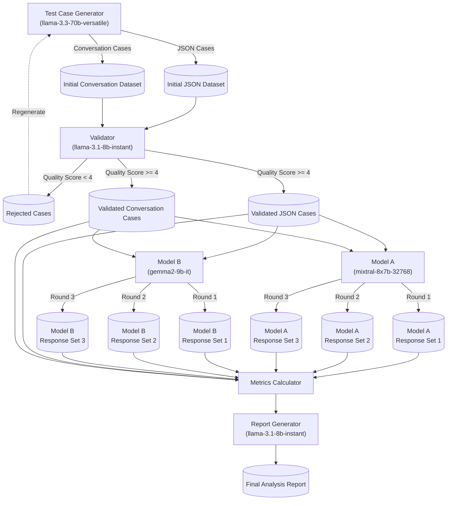

# AI Model Benchmarking Pipeline

A comprehensive pipeline for benchmarking AI language models using Groq's tool-based architecture. Specializes in evaluating model performance in customer service scenarios through automated test generation, validation, and analysis.

## 🚀 Key Features

- Tool-based test case generation using LLMs
- Multi-stage validation with quality scoring
- A/B testing framework for model comparison
- Comprehensive metrics calculation (BLEU, WER, custom metrics)
- Asynchronous execution with robust error handling
- Configurable feature flags for JSON/conversation test types
- Automated analysis report generation

## 📋 Prerequisites

```bash
# Python packages
langchain>=0.1.0
langchain-groq>=0.1.0
langchain-community>=0.1.0
nltk>=3.8.1
jiwer>=3.0.1
pandas>=2.0.0
numpy>=1.24.0
tqdm>=4.66.0
rich>=13.7.0
jsonschema>=4.21.1
matplotlib>=3.8.0
seaborn>=0.13.0
asyncio>=3.4.3

# Environment Setup
export GROQ_API_KEY="your_api_key_here"
```

## 🏗️ Architecture



The pipeline consists of four main phases, each utilizing specialized LLM agents with tool capabilities:

### 1. Generation Phase
- **Agent**: Test Case Generator (llama-3.3-70b-versatile)
- **Tools**: 
  - JSON Generator Tool: Creates structured test cases
  - Conversation Generator Tool: Creates natural language pairs
- **Output**: Initial test datasets (JSON and conversation formats)

### 2. Validation Phase
- **Agent**: Validator (llama-3.1-8b-instant)
- **Tool**: Validator Tool for quality scoring
- **Process**: Filters cases (threshold score ≥ 4)
- **Output**: Validated test cases

### 3. Execution Phase
- **Model A**: mixtral-8x7b-32768
- **Model B**: gemma2-9b-it
- **Tool**: Customer Response Processor
- **Process**: 3 rounds of testing per model

### 4. Analysis Phase
- **Agent**: Report Generator (llama-3.1-8b-instant)
- **Output**: Comprehensive analysis in Markdown

## 🛠️ Error Handling & Rate Limiting

```python
@groq_rate_limit(max_retries=3, base_delay=1.0)
async def function_call():
    # Implements exponential backoff
    # max_delay = min(300, 2^attempt + random(0,1))
```

- Exponential backoff with randomization
- Configurable retry limits (default: 3 attempts)
- Detailed error logging and tracking
- Rate limit handling for Groq API

## 📊 Metrics

### Conversation Metrics
- **Response Relevance**: Jaccard similarity score
- **Clarity**: Sentence structure analysis (0-1)
- **Task Completion**: Keyword overlap with bonus multiplier
- **BLEU Score**: N-gram overlap measurement
- **WER**: Word Error Rate calculation

### JSON Metrics
- Schema compliance rate
- Field accuracy
- Structural consistency

## 🚦 Logging

```python
logger = setup_logging(__name__)
# Formats: timestamp - name - level - message
# Outputs: console + debug.log file
```

## 📝 Quick Start

```python
from pipeline_v2 import BenchmarkPipeline

async def run_benchmark():
    pipeline = BenchmarkPipeline()
    metrics = await pipeline.run()
    return metrics

# Execute
asyncio.run(run_benchmark())
```

## 🔧 Tool Specifications

### JSON Generator Tool
```json
{
    "type": "function",
    "function": {
        "name": "generate_json_test",
        "description": "Generate structured test cases",
        "parameters": {
            "type": "object",
            "properties": {
                "id": {"type": "string"},
                "prompt": {"type": "string"},
                "golden_response": {"type": "object"},
                "test_case": {"type": "string"}
            }
        }
    }
}
```

### Validator Tool
```json
{
    "type": "function",
    "function": {
        "name": "validate_test_case",
        "parameters": {
            "type": "object",
            "properties": {
                "id": {"type": "string"},
                "prompt_quality_score": {"type": "integer", "minimum": 0, "maximum": 5},
                "response_quality_score": {"type": "integer", "minimum": 0, "maximum": 5}
            }
        }
    }
}
```

## 📈 Output Structure

Generated under `benchmark_results/run_{timestamp}/`:
- `initial_tests.csv`: Raw generated test cases
- `validated_tests.csv`: Quality-filtered cases
- `{model}_all_responses.csv`: Individual model results
- `combined_model_responses.csv`: Comparative results
- `metrics.json`: Raw performance metrics
- `metrics_report.json`: Structured analysis
- `analysis_report.md`: Final report

## 📄 License

[Insert License Information]

## 🙏 Acknowledgments

Built with [Groq](https://groq.com/) for high-performance LLM inference.