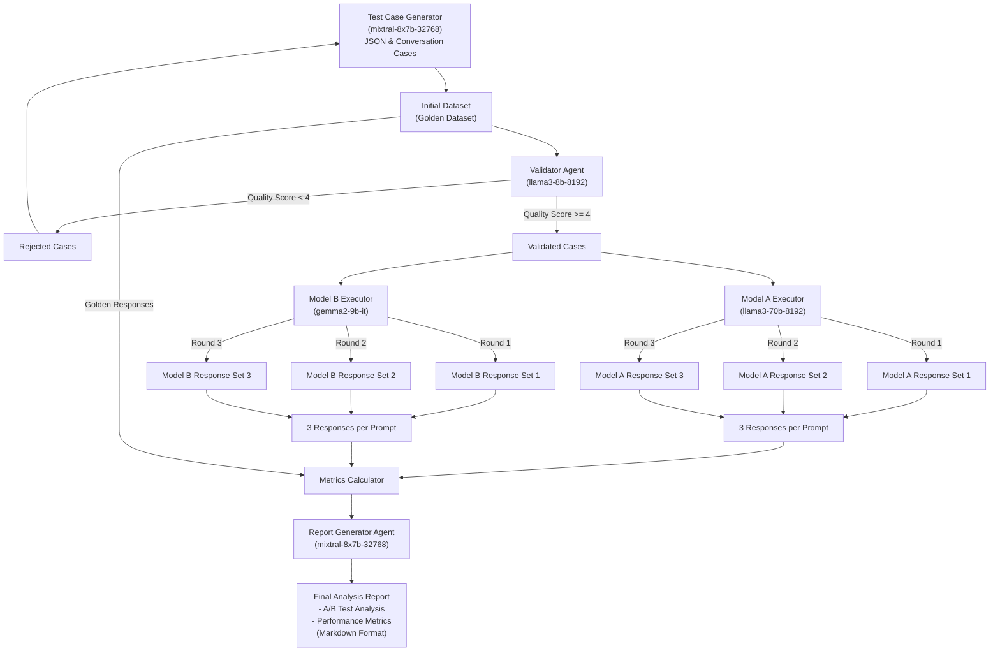

# Synthetic AI Model Benchmarking Pipeline

## Overview
This project works to implement an end-to-end pipeline for benchmarking AI language models through a systematic approach to test case generation, validation, and evaluation. The pipeline specializes in creating and utilizing "golden datasets" for comparing model performances in customer service scenarios. This is an illustrative example of how a golden dataset for a given topic could be created and used for evaluation. Future iterations look to include the ability to load in your own Golden Dataset for evaluation.

## Key Features
- Automated generation of diverse test cases using LLMs
- Multi-stage validation process for ensuring high-quality test data
- A/B testing framework for model comparison 
- Comprehensive metrics calculation (BLEU, WER, custom metrics)
- Asynchronous execution for improved performance
- Robust error handling and retry mechanisms
- Configurable feature flags for JSON test generation and validation
- Final analysis report generated by a dedicated agent

## Architecture

## Pipeline Workflow

The following diagram illustrates the end-to-end workflow of our benchmarking pipeline:



The pipeline consists of several key phases:

1. **Generation Phase**: A test case generator creates the initial golden dataset containing both JSON and conversation test cases using mixtral-8x7b-32768.

2. **Validation Phase**: A validator agent (llama3-8b-8192) assesses each test case, filtering out low-quality cases (score < 4) and passing high-quality cases (score >= 4) to the execution phase.

3. **Execution Phase**: Two model executors (Model A: llama3-70b-8192 and Model B: gemma2-9b-it) process the validated test cases. Each model runs three rounds of testing to ensure consistency.

4. **Evaluation Phase**: A metrics calculator processes the results from both models along with the golden responses. The calculated metrics are then passed to a report generator (mixtral-8x7b-32768) which produces a final analysis report in Markdown format, including A/B test analysis and detailed performance metrics.

### Components - Python Files
1. **Test Generator** (`test_generator.py`)
   - Generates test cases for both structured JSON outputs and conversational responses
   - Uses LLMs to create diverse, realistic customer service scenarios
   - Implements id-based test case tracking
   - Feature flag to enable/disable JSON test generation

2. **Test Validator** (`test_validator.py`) 
   - Validates generated test cases against predefined schemas
   - Scores prompt and response quality
   - Filters out low-quality test cases (quality score < 3)
   - Feature flag to enable/disable validation for all tests

3. **Test Executor** (`test_executor.py`)
   - Manages A/B testing between different models
   - Implements exponential backoff for API rate limiting
   - Handles test case execution with configurable retry logic

4. **Metrics Calculator** (`metrics_calculator.py`)
   - Calculates standard NLP metrics (BLEU, WER)
   - Implements custom metrics for response relevance, clarity, and task completion
   - Generates comprehensive performance reports

### Pipeline Flow
1. Test case generation with specified schemas and formats (if enabled)
2. Validation of generated cases against quality criteria (if enabled) 
3. Execution of validated cases (or imported golden dataset) against multiple models
4. Calculation of performance metrics and comparison analysis
5. Generation of final analysis report by the dedicated agent

## Configuration

### Test Configuration (`test_config.py`)
- Feature flags to control JSON test generation and validation
- Test case schemas for both JSON and conversational formats
- Response validation criteria
- Metric definitions and calculations
- Test categories and sampling parameters

### Agent Configuration (`agent_config.py`)
- Defines specialized agents for different pipeline stages:
  - JSON Generator Agent: Creates structured test cases (mixtral-8x7b-32768)
  - Conversation Generator Agent: Creates natural language pairs (mixtral-8x7b-32768) 
  - Validator Agent: Evaluates test quality (llama3-8b-8192)
  - Executor Agents: Model A (llama3-70b-8192) and Model B (gemma2-9b-it)
  - Analysis Report Generator Agent: Writes final report (mixtral-8x7b-32768)
- Contains prompt templates for each agent type
- Specifies model parameters (temperature, sampling settings)
- Defines response formats and validation criteria

### Benchmark Configuration (`benchmark_config.py`)
- Model selection and API configurations 
- Test execution parameters (rounds, timeouts, retries)
- Environment settings

## Usage

### Prerequisites
```bash
pip install -r requirements.txt
```

### Environment Setup
Set required environment variables:
```bash 
export GROQ_API_KEY="your_api_key_here"
```

### Running the Pipeline
```python
from pipeline_v2 import BenchmarkPipeline

pipeline = BenchmarkPipeline()
metrics = await pipeline.run()
```

## Output Structure
The pipeline generates several outputs:
- Validated test cases CSV (if validation enabled)
- Individual model responses
- Combined model comparison results
- Detailed metrics report in JSON format  
- Final analysis report from the dedicated agent

## Metrics
The pipeline calculates two sets of metrics:

### JSON Test Metrics (more to come)
- Schema compliance rate
- Field accuracy  
- Structural consistency

### Conversation Metrics

The pipeline evaluates model responses using the following metrics:

- **Response Relevance**: Measures how well the response addresses the input prompt using Jaccard similarity between tokenized prompt and response (excluding stop words). Higher scores indicate better topical alignment between the question and answer.

- **Clarity**: Evaluates response readability based on sentence structure:
  - Penalizes extremely long sentences (>50 words) and very short sentences (<3 words)
  - Considers the presence of transition words (e.g., 'however', 'but', 'although')
  - Scores range from 0-1, with higher scores indicating clearer responses

- **Task Completion**: Assesses how thoroughly the response addresses the prompt:
  - Calculates overlap between task-specific keywords from prompt and response
  - Applies a bonus multiplier (1.2x) when resolution indicators are present (e.g., 'resolved', 'completed', 'solution')
  - Higher scores suggest more comprehensive problem resolution

- **BLEU Score**: (Bilingual Evaluation Understudy)
  - Standard metric for comparing model output against reference text
  - Measures n-gram overlap between model response and golden response
  - Range: 0-1, where higher scores indicate better match with reference answer

- **Word Error Rate (WER)**:
  - Calculates minimum number of word-level operations (insertions, deletions, substitutions) needed to transform model response into reference response
  - Lower scores indicate closer match to golden response
  - Useful for identifying significant deviations from expected responses

## Implementation Details

### Testing Approach
- Multiple test rounds for statistical significance
- Balanced test case distribution across categories 
- Isolated execution environments for different models
- Synthetic golden dataset validation:
  - Controlled by `enable_validation` flag in `TestConfig`
  - Validates generated test cases against predefined schemas and quality criteria
  - Filters out low-quality test cases
- A/B output metrics calculation:
  - Handled by `MetricsCalculator` class in `metrics_calculator.py`
  - JSON test metrics: schema compliance, field accuracy, structural consistency
  - Conversation test metrics: BLEU, WER, relevance, clarity, task completion
  - Metrics based on test configuration and A/B results

### Error Handling
- **Exponential Backoff**: Implements delay = min(300, 2^attempt + random(0,1)) seconds between retries
- **Retry Mechanism**: Configurable MAX_RETRIES (default: 3) with detailed error tracking per attempt
- **Error Logging**: Saves failed attempts to timestamped CSV files with attempt number, error message, and full context

### Data Validation 
- **JSON Validation**: Uses jsonschema.Draft7Validator to verify structure and data types of model outputs
- **Quality Scoring**: Evaluates responses on prompt relevance (0-5) and response completeness (0-5)
- **Validation Pipeline**:
  1. Checks structural compliance
  2. Validates field types and constraints
  3. Scores response quality
  4. Routes failed cases back to generation

## Future Enhancements
- **Metrics Expansion**: Add toxicity scoring, contextual relevance, and sentiment analysis
- **Test Generation**: Implement few-shot learning and adversarial test case generation
- **Golden Set Integration**: Add support for CSV/JSON/JSONL golden dataset imports
- **Evaluation Tooling**: Build interactive dashboard for results analysis

## Technical Decisions  
- **Async Implementation**: Uses asyncio for concurrent model calls and file operations
- **Modular Design**: Each component (Generator, Validator, Executor, Calculator) is independently configurable
- **Logging Strategy**: Structured logging with configurable verbosity and output formats
- **Configuration Management**: External YAML config files for environment-specific settings
- **Feature Toggles**: Controls for JSON testing, validation strictness, and metric selection